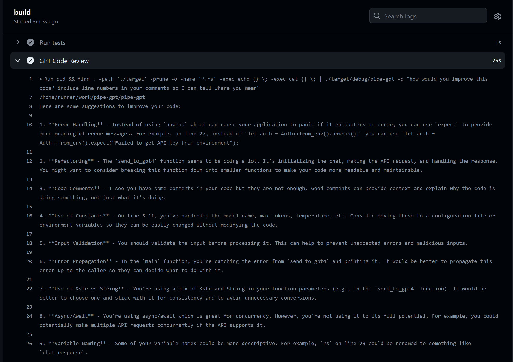

# Pipe | GPT
Pipe your content to gpt directly from the command line. A concept that allows for a lot of possibilities.

## Use cases

### Local command-line usage
- `tail -30 /var/httpd.log | pipe-gpt --p "Is there anything in the http log file I should fix?"`
- `cat main.rs | pipegpt -p "How would you improve this code? Include line numbers in your comments so I can tell where you mean."`
- `cat main.rs | pipegpt -p "Is this code production ready? If yes reply 'Yes'. If no, then explain why not. Be concise."`
- `cat file.json | pipegpt -p "Convert this JSON to YAML"`
- `cat french.txt | pipegpt -p "Translate this to English please."` 
- `git diff --staged | pipegpt -p "Code review this code change"`

### Pipe | GPT for local dev


```
user@computer:/GitHub/pipe-gpt$ cat src/main.rs | pipe-gpt -p "how would you improve this code? include line numbers in your comments so I can tell where you mean"

Here are some suggestions to improve your code:

1. Line 2, 3: You can combine these two lines into one as follows:
`use openai_api_rust::{*, chat::*};`

2. Line 6-16: You can simplify the creation of `conversation_messages` by using a `Vec::new()` and then pushing messages as needed. This way, you avoid creating an unnecessary `Message` when `prepend` is empty.

3. Line 18-19: Instead of using `unwrap()`, it's better to handle the error properly. You can use `?` to propagate the error up.

4. Line 20-33: You can create a function to initialize `ChatBody` to make the code cleaner.

5. Line 35-38: Instead of using `unwrap()`, it's better to handle the error properly. You can use `match` to handle the possible `None` case.
```

### Pipe | GPT for CI

```yaml
jobs:
  build:

    runs-on: ubuntu-latest

    steps:
    - uses: actions/checkout@v3
    - name: Build
      run: cargo build --verbose
    - name: Run tests
      run: cargo test --verbose
    - name: GPT Code Review
      env:
        OPENAI_API_KEY: ${{ secrets.OPENAI_API_KEY }}
      run: pwd && find . -path './target' -prune -o -name '*.rs' -exec echo {} \; -exec cat {} \; | ./target/debug/pipe-gpt -p "how would you improve this code? include line numbers in your comments so I can tell where you mean"
```

Which gives this output in Github Actions CI:


## Examples of full commands
```sh
cat src/main.rs  | OPENAI_API_KEY='sk-abc123' ./target/debug/pipe-gpt -p "how would you improve this code? include line numbers in your comments so I can tell where you mean"
```
```sh
cat src/main.rs  | OPENAI_API_KEY='sk-abc123' ./target/debug/pipe-gpt -p "improve the code and only output the replacement code as I will pipe the output directly back into the source file, no explanations, just pure code" > src/main.rs
```

## ToDo
 - Add unit tests
 - Add documentation
 - Support roles such as "software developer", "data scientist" etc
 - Release crate

## Set the open api key env var in windows powershell
```powershell
$env:OPENAI_API_KEY = 'sk-12345abc'
```

## Set the open api key env var in linux
```sh
export OPENAI_API_KEY=sk-12345abc
```

## Useful links
 - https://platform.openai.com/account/usage
 - https://platform.openai.com/docs/api-reference/chat/create
 - https://platform.openai.com/docs/models/overview
